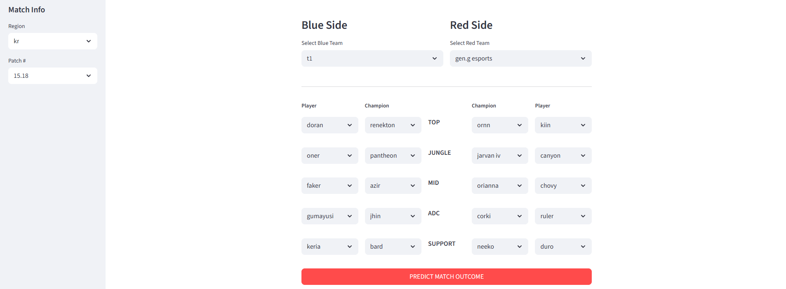

# League of Legends Esports Match Predictor

Hosted at http://lolesports-predictor.streamlit.app

This is a personal project that predicts the outcome of professional League of Legends matches using machine learning. The model analyzes team strength, player statistics, and champion picks to try to predict match winners with approximately 75% test accuracy on both models.

This project demonstrates an end-to-end machine learning workflow with four main components:
1. A web scraper that collects professional match data from major regions in the 2025 season from gol.gg
2. A data processing notebook that transforms raw match data, engineers features and removes unnecessary features
3. A model training notebook that calculates team ELO ratings, encodes categorical features and trains machine learning models
4. A web application that loads the two best models to predict match outcomes

## Features:
- Two machine learning models:
    - Voting Ensemble: combines XGBoost (gradient boosting) and Elastic Net (regularized logistic regression) for improved accuracy and reduced variance
    - Elastic Net: regularized logistic regression model for baseline comparison
- Regional team ELO rating system:
    - Teams start with a region based initial rating based on relative strength of region
    - ELO rating changes depend on the strength difference between teams
    - Uses K-factor of 32 to adjust how each match impacts team ratings
- Historical player performance tracking across multiple game statistics

## Match Setup Interface:

1. Select region and patch version from side bar
2. Choose teams for bleu and red side
3. Select players and champions for each role
4. Select "Predict Match Outcome Button" for predictions from both models

## Prediction Results:

## Model Performance:
- Voting Ensemble: 75.76% test accuracy
- Elastic Net: 74.89% test accuracy
- Dataset: 2286 professional matches from major regions